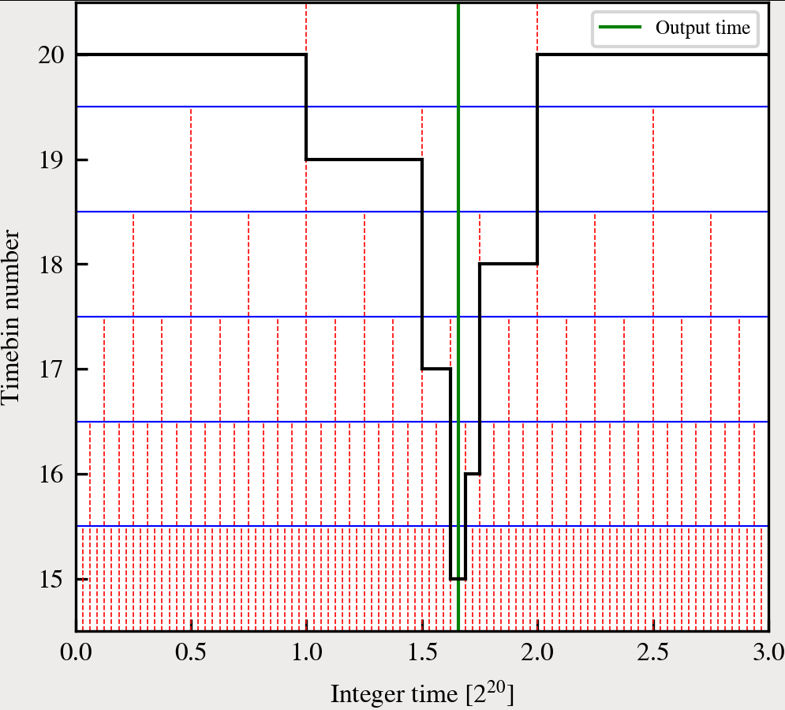

GADGET-4
========

GADGET-4 is a massively parallel code for N-body/hydrodynamical
cosmological simulations. It is a flexible code that can be applied to
a variety of different types of simulations, offering a number of
sophisticated simulation algorithms.  An account of the numerical
algorithms employed by the code is given in the original code paper,
subsequent publications, and this documentation.

GADGET-4 was written mainly by
[Volker Springel](mailto:vspringel@mpa-garching.mpg.de), with
important contributions and suggestions being made by numerous people,
including [Ruediger Pakmor](mailto:rpakmor@mpa-garching.mpg.de),
[Oliver Zier](mailto:ozier@mpa-garching.mpg.de), and
[Martin Reinecke](mailto:martin@mpa-garching.mpg.de).

Documentation
=============

For documentation of the code as well as the code paper, please refer
to the [code's web-site](https://wwwmpa.mpa-garching.mpg.de/gadget4).

About this fork
========

This fork incorporates a new Config.sh flag (OUTPUT_LIMITED_TIMESTEP) 
and associated parameter (OutputTimePrecision). They were added to allow
for finer control in the output times of files. In original GADGET4, the 
minimum spacing between <ins>synchronised</ins> outputs cannot be smaller 
than about half the value of MaxSizeTimestep. This means that unless its value
is lowered, some outputs will be skipped. However, changing MaxSizeTimestep affects 
**all** the simulation timesteps, meaning that even if outputs are only required
during a small subset of time (e.g. z < 2), many more smaller timesteps are taken across
the whole simulation. This fork provides an alternative way of allowing that d.

To illustrate these changes, I have run a simulation where I use the new additions and 
requested an output shortly after the start. The value I used for MaxSizeTimestep 
corresponds to the 20th timebin, whereas OutputTimePrecision corresponds to a timebin of 15. 

The plot below shows how the simulation advances in (integer) time during the first few timesteps. 
Dashed, vertical red lines indicate the integer times the simulation can reach, whose density varies 
across each timebin. The green line is the output time and the black line shows the timesteps taken
by the simulation, with vertical directions indicating timebin traversal.

Firstly, the output time is mapped to the grid defined by the 15th timebin; without OutputTimePrecision,
it would have used the 20th timebin grid. Secondly, the simulation will try to take the largest timestep
possible, without overshooting the requested output time. This timestep limiter only affects timesteps close
to requested output times, which is why after saving the output, it returns to the largest timestep the simulation
can take (subject to other timestepping limiters, such as local gravitational acceleration). Without this last feature,
the simulation would have taken all its timesteps in the 15th timebin, greatly increasing the number (and thus runtime) taken 
to advance the simulation.
